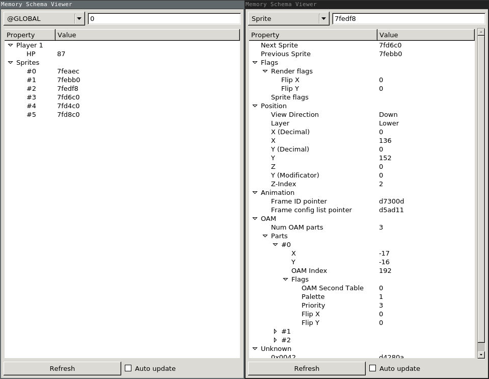

# Memory Schema Viewer

The memory schema viewer allows you to create a JSON file which describes the structure of the games RAM and visualize it easily.

## Features

- Parses JSON files (Example for [Seiken Densetsu 3 (Japan)](./example.schema.json))
- Display values from constant addresses
- Display integers as string (example: 0 -> Off, 1 -> Normal, 2 -> Animated, ...)
- Parse flag bytes which contain several properties
- Add lists or linked lists
- Open multiple windows to compare values

## Missing Features

- Memory Schema Editor
- Edit values from Memory Schema Viewer directly
- Add breakpoints from Memory Schema Viewer directly
- Click on addresses to jump directly to a structure

## How it works

1. Open your text editor and create an empty JSON file
2. Save it next to your ROM with the same filename as your cartridge but with the `.schema.json` extension
3. Open the debugger and click on Tools / Memory Schema Viewer

## Schema file format

The JSON has a simple file format. See the example file for [Seiken Densetsu 3 (Japan)](./example.schema.json) for details.

    {
      "variables": {
        "hp": {"name": "HP", "type": "uint16", "offset": {"address": {"$": "7ff0f2"}},

        ... global variables
      },
      "types: {
        "Layer": {"enum": {
          ...
        }},

        ... reusable types
      }
    }

To see the example working, you'll need the Japan version of the game and put the file next to the ROM, renaming it to `romname.schema.json` if `romname.sfc` is the cartridge file.

### Constants

Constant numbers can either simply written as a number or, in case you want
to use HEX numbers, you can write `{"$": "7f0000"}`

### Addresses

Addresses are relative when used within structs. However, if you want to
use a constant address, you can use `{"address": 1234567}` 

### Numbers

You can use the following constants for numbers:

- boolean
- int8
- int16
- int24
- int32
- uint8
- uint16
- uint24
- uint32

### enum

Allows to define a number to string map. Use `bits` or `bytes` to define the
size in bits or bytes.

    {"enum": {
      "bits": 2,
      "values": {
        "right": {"name": "Right", "value": 0},
        "down": {"name": "Down", "value": 1},
        "left": {"name": "Left", "value": 2},
        "up": {"name": "Up", "value": 3}
      }
    }}

### flags

Allows to split a byte into several smaller values.

    {"flags": {
      "bytes": 1,
      
      "members": {
        "name":     {"name": "Name",     "offset": 0, "bits": 1, "type": "boolean"},
        "palette":  {"name": "Palette",  "offset": 1, "bits": 3, "type": "uint8"},
        "priority": {"name": "Priority", "offset": 4, "bits": 2, "type": "uint8"},
        "flip_x":   {"name": "Flip X",   "offset": 6, "bits": 1, "type": "boolean"},
        "flip_y":   {"name": "Flip Y",   "offset": 7, "bits": 1, "type": "boolean"}
      }
    }}

### pointer

Points to another object using a memory address

    {"pointer": {"to": "Sprite", "type": "uint16", "bank": "same", "nullable": true}}

### struct

Allows to define complex structures.

    {"struct": {
      "bytes": 4,

      "members": {
        "x":     {"name": "X",         "offset": 0, "type": "int8"},
        "y":     {"name": "Y",         "offset": 1, "type": "int8"},
        "oam":   {"name": "OAM Index", "offset": 2, "type": "uint8"},
        "flags": {"name": "Flags",     "offset": 3, "type": "SpriteOamPartFlags"}
      }
    }},

### list

Defines a list of structures. Be sure to keep max_items to a low value to prevent
infinite loops in case of invalid data pointers.

    {"type": "SpriteOamPart", "length": {"value_of": "num_sprite_parts"}, "max_length": 15}}

### linkedlist

Defines a list which is linked using pointers within the target structures.

    {"linkedlist": {"to": "Sprite", "type": "uint16", "bank": 127, "nullable": true, "next": "next_sprite"}}}
